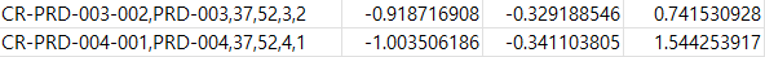
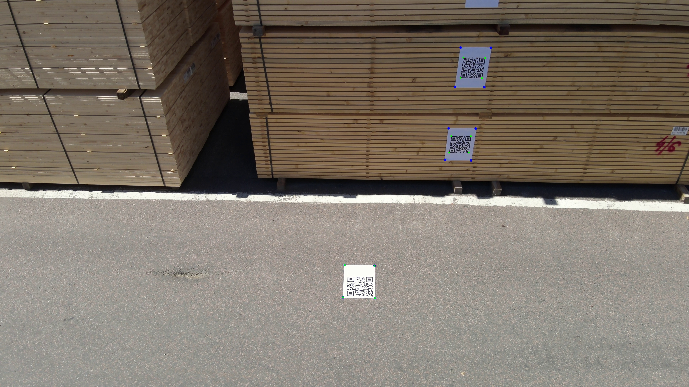
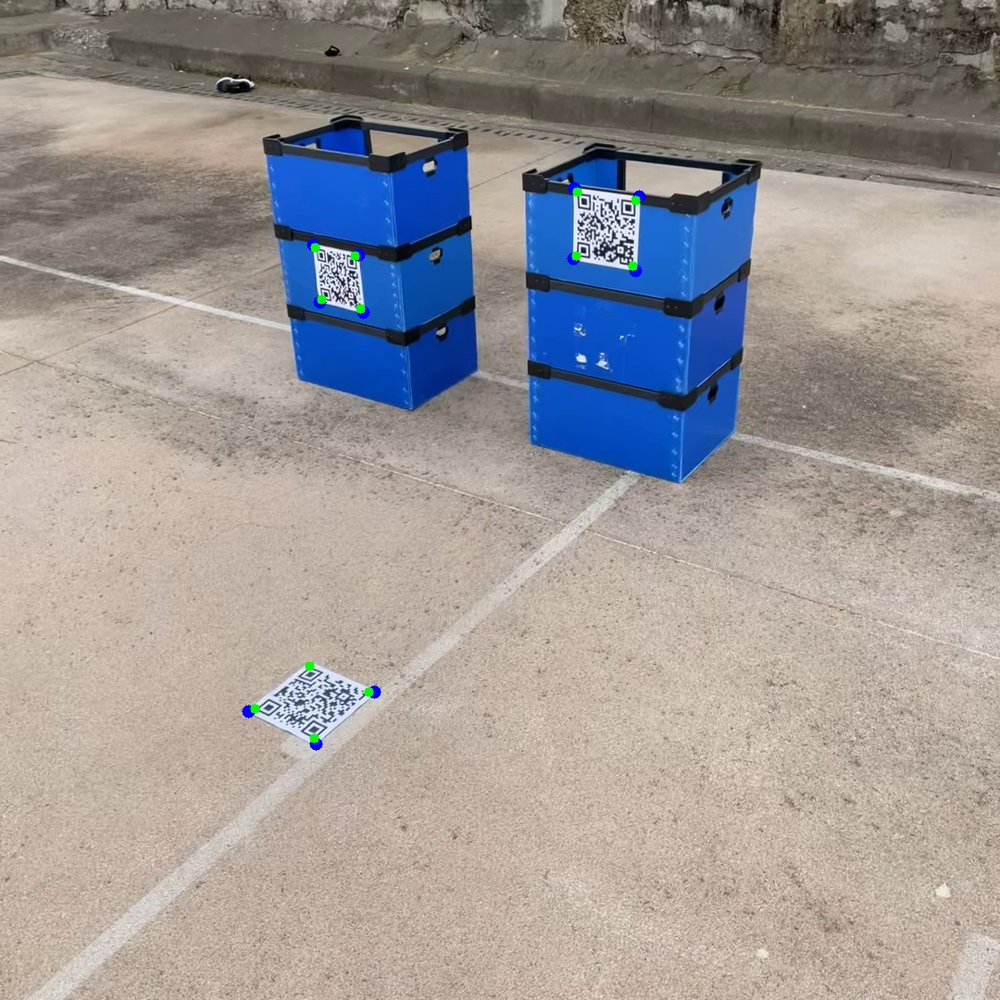

# Inventory Recognition and Position Estimation through Drone Video (using QR Code)

## Checkpoints Downloads
Download and move checkpoints to 'checkpoint' folder
1. GroundingDINO-T : `groundingdnino_swint_ogc.pth` [[Downloads]](https://github.com/IDEA-Research/GroundingDINO#luggage-checkpoints) 
2. Vit-H SAM model : `sam_vit_h_4b8939.pth` [[Downloads]](https://github.com/facebookresearch/segment-anything#model-checkpoints) 


## Installation 
Set up
```
conda create -n [env_name] python==3.9
conda activate [env_name]
```
Install suitable [CUDA](https://docs.conda.io/en/latest/) environment and [Pytorch](https://pytorch.org/) (< pytorch v.2.0)
```
conda install pytorch==1.12.1 torchvision==0.13.1 torchaudio==0.12.1 cudatoolkit=11.3 -c pytorch
```

Install Requirements
```
pip install -r requirements.txt
```

Install Segment Anything, GroundingDINO 
```
cd GSA/segment_anything
pip install -e .
cd ..
cd GroundingDINO
pip install -e .
```

## Inference
Prepare Data 

- Move custom videos to `./test/video/`
- Write marker position in `./test/floor_points.txt` 

Run `prototype.py`
```
python prototype.py 
```

```
optional arguments:
  --skip, -s            Number of frames to use for position estimation, `default=5`
  --save_video          Save inventory recognition result video (QRcode decoding results), 'default=False'
  --root, -r            test folder location, `default=test` 
```


[//]: # (### To-Do)

[//]: # (- [x] Add inference )

[//]: # (- [x] Add training codes)

[//]: # (- [x] Add dockerHub link)

[//]: # (- [x] Add colab)

## Result Examples
- Results of Inventory location (QR code information, x, y, z) (`./(test_folder)/results/(video_name).csv`)



- (Optional `--save_video`) Results of Inventory recognition 






## References

[1] Grounded Segment Anything. [[code]](https://github.com/IDEA-Research/Grounded-Segment-Anything)

[2] Segment Anything. [[code]](https://github.com/facebookresearch/segment-anything)
